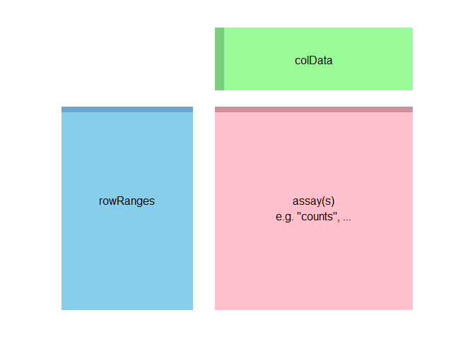
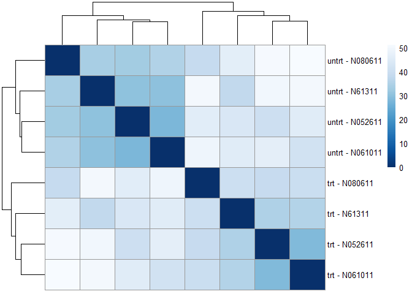
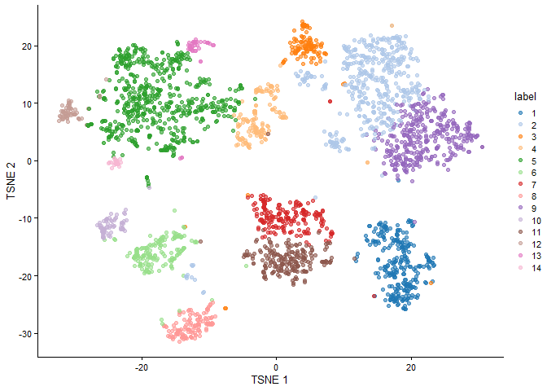
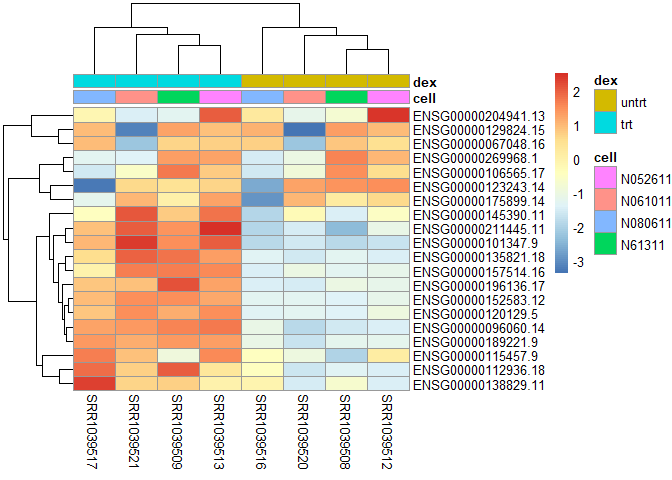
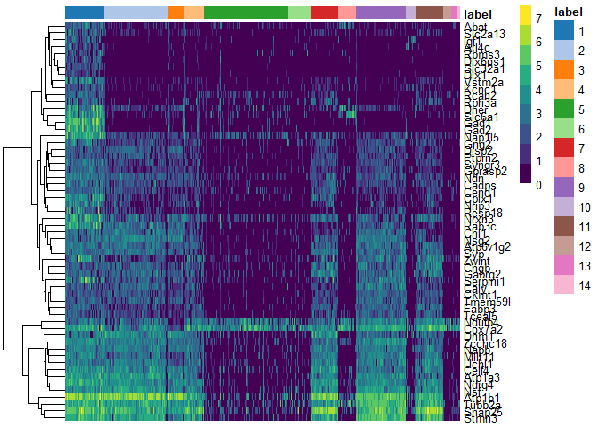

# RNA-seq analysis using simpleSingleCell from Bioconductor
Report based on the `simpleSingleCell` Bioconductor workflow

## Professor’s note (example)

> This branch isn’t perfect, but it will give you an idea of what I’m
> looking for in your final project. It represents the work of some
> previous students. The analysis script, in particular, is a little on
> the long side and is short on documentation toward the end of the
> document (including references).

## Introduction: CRISPLD2 (example)

Airway dataset summarizes an RNA-seq experiment where airway smooth
muscle cells were treated with dexamethasone, a synthetic glucocorticoid
steroid with anti-inflammatory effects (Himes et al. 2014).

## Installation
To install this package, start R (version "4.5" or greater) and enter:
`if (!require("BiocManager", quietly = TRUE))`
    `install.packages("BiocManager")`

`BiocManager::install("simpleSingleCell")`

## Documentation
To view documentation for the version of this package installed in your system, start R and enter:

`browseVignettes("simpleSingleCell")`

## Step 1: Experimental Data (example)

### The dataset for this analysis was from the “airway” package.

To access this dataset we need to first install the BiocManager package:

`if (!require("BiocManager", quietly = TRUE))     install.packages("BiocManager")`

Then we can install the airway package:

`BiocManager::install("airway")`.

### Data: Experimental Data (example)

Here is a list of the files in the airway package:

     [1] "GSE52778_series_matrix.txt"        "Homo_sapiens.GRCh37.75_subset.gtf"
     [3] "quants"                            "sample_table.csv"                 
     [5] "SraRunInfo_SRP033351.csv"          "SRR1039508_subset.bam"            
     [7] "SRR1039509_subset.bam"             "SRR1039512_subset.bam"            
     [9] "SRR1039513_subset.bam"             "SRR1039516_subset.bam"            
    [11] "SRR1039517_subset.bam"             "SRR1039520_subset.bam"            
    [13] "SRR1039521_subset.bam"            

Under the “quants” directory we have these files:

    [1] "SRR1039508" "SRR1039509"

We can open the sample_table.csv and find the following data:

|  | SampleName | cell | dex | albut | Run | avgLength | Experiment | Sample | BioSample |
|:---|:---|:---|:---|:---|:---|---:|:---|:---|:---|
| SRR1039508 | GSM1275862 | N61311 | untrt | untrt | SRR1039508 | 126 | SRX384345 | SRS508568 | SAMN02422669 |
| SRR1039509 | GSM1275863 | N61311 | trt | untrt | SRR1039509 | 126 | SRX384346 | SRS508567 | SAMN02422675 |
| SRR1039512 | GSM1275866 | N052611 | untrt | untrt | SRR1039512 | 126 | SRX384349 | SRS508571 | SAMN02422678 |
| SRR1039513 | GSM1275867 | N052611 | trt | untrt | SRR1039513 | 87 | SRX384350 | SRS508572 | SAMN02422670 |
| SRR1039516 | GSM1275870 | N080611 | untrt | untrt | SRR1039516 | 120 | SRX384353 | SRS508575 | SAMN02422682 |
| SRR1039517 | GSM1275871 | N080611 | trt | untrt | SRR1039517 | 126 | SRX384354 | SRS508576 | SAMN02422673 |

### Data (example)

From here, the example in the vignette uses these parts of the
sample_text.csv:

|  | SampleName | cell | dex | albut | Run | avgLength | Experiment | Sample | BioSample | names |
|:---|:---|:---|:---|:---|:---|---:|:---|:---|:---|:---|
| SRR1039508 | GSM1275862 | N61311 | untrt | untrt | SRR1039508 | 126 | SRX384345 | SRS508568 | SAMN02422669 | SRR1039508 |
| SRR1039509 | GSM1275863 | N61311 | trt | untrt | SRR1039509 | 126 | SRX384346 | SRS508567 | SAMN02422675 | SRR1039509 |

And calls the sample name from the “quants” directory:

``` r
coldata$files <- file.path(dir, "quants", coldata$names, "quant.sf.gz")
file.exists(coldata$files)
```

    [1] TRUE TRUE

### Experimental Data (example)



## Overview of Analysis Method (example)

- Alignment of reads to a reference transcriptome

- Generation of a count matrix and SummarizedExerpiment

- Differential expression analysis using statistical modeling (using
  DESeq2)

## STEP 2. Preparing quantification input to DESeq2 (example)

In order to run the count-based statistical methods such as : DESeq2,
edgeR, limma, EBseq, baySeq. You would need to take the high-throughput
sequences matrix’s into un-normalized counts.

<!-- Professor's note: these image files don't have helpful names -->


For the purpose of preparing the sequence for DESeq2, the data needs to
be count matrix. The matrix contains raw counts of sequencing reads
mapped to each gene for each sample.

### WORKFLOW : COUNT MATRIX - TRASNCRIPT QUANTIFICATION (SALMON ) - TXIMPORT SUMMARY GENE-LEVEL (example)

Align the reads to the genome and begin to count the reads that are
consistent with the gene models. This is done by obtaining the
transcript quantification.

Processes with transcript quantification methods such as (without
aligning reads)

- Salmon

- Kallisto

- RSEM

### QUANTIFYING SALMON (example)

Salmon is a A transcript quantification method that is fast, accurate
and bias-aware in quantification from RNA-seq data.

- Indexing the transcriptome

- Obtaining the Reads

- Quantifying the Samples

#### QUANTIFYING SALMON: INDEXING THE TRASNCRIPTOME (example)

The index helps create a signature for each transcript in our reference
transcriptome. The Salmon index has two components:

- A suffix array (SA) of the reference transcriptome

- A hash table to map each transcript in the reference transcriptome to
  it’s location in the SA (is not required, but improves the speed of
  mapping drastically)


#### QUANTIFYING SALMON: OBTAINING THE READS (example)


#### QUANTIFYING SALMON: ABUNDANCE QUANTIFICATION (example)

After determining the read/fragment using the quasi mapping methods,
salmon will generate the final transcript abundance estimates .

- Length of the transcript

- Effective length

- TPM(transcripts per million) normalization method

- Number of reads, estimate of number of reads drawn from this
  transcript given the transcripts relative abundance and length.

### READING DATA WITH TXIMETA (example)

<u>HOW DOES TXIMPORT WORK:</u>

It takes import transcript level estimates to summarize abundances,
counts, and transcript lengths to the gene-level or outputs transcript
level matrices.

The advantages of using the transcript abundance quantifiers in
conjunction with *tximport* to produce gene-level count matrices and
normalizing offsets are: this approach corrects for any potential
changes in gene length across samples


- *DESEQ2 import functions*

### SUMMARIZED EXPERIMENT (example)


## STEP 3: DESeq2 (example)

What is it?

What dose DESeqDataSet object do?

### METHOD OVERVIEW OF WORKFLOW (example)


### METHOD HIGHLIGHT (example)

These tools and methods are optimized for reproducibility, statistical
rigor, and comprehensive visualization in RNA-Seq workflows. They align
well with Bioconductor standards for analysis and open science.
Preventing biases, in order to ensure that.

<!-- Professor's note: rather than dropping this large code chunk here, it would be better to run (or source) the analysis at the beginning of the document in the setup chunk. Sourcing would be beneificial because you could use the same code here as you do in the analysis script. -->

## STEP 4: Exploratory Analysis and Visualization: (example)

### Scatterplot of transformed counts from two samples (example)

It compares three transformations (log2, vst, and rlog) and shows the
differences in density and spread of counts after applying
transformation.


### Heatmap of sample-to-sample distances using the variance stabilizing transformed values. (example)

The plot compares untreated and treated groups across four conditions,
indicating condition-specific and possibly variable treatment effects.



### PCA plot using the VSD data (example)

The PCA plot shows clusters of samples grouped by experimental
conditions across four conditions. PC1 and PC2 explain 52% and 22% of
the variance, respectively.


### Normalized counts for a single gene over treatment group (example)

It confirms the significance of a top differentially expressed gene.



### Heatmap of relative VST-transformed values across samples (example)

It shows clusters of genes with similar expression patterns across
conditions and highlights key genes driving variability in the dataset.



### Normalized counts for a gene with condition-specific changes over time (example)

It shows differences in expression dynamics over time.



## STEP 5: Differential Expression Analysis (example)

Differential expression analysis aims to identify genes that exhibit
significant changes in expression levels between two or more conditions.

- Non-Treatment Group (gene expression on cells for)

- Treatment Group (gene expression on cells for)

The workflow of requires DESeqDATAset to run raw counts of genes in
DESeq, returning:

- estimate of size factor

- estimate of dispersion values for each gene

- fitting generalized linear model  


### OVERVIEW DIFFERENTIAL GENE EXPRESSION (example)


## Conclusion (example)

### What interesting things / skills did you learn? (example)

- The detail and order it took to organize and produce count reads to
  prevent blanks, biases, and only targeted genes to be analyzed. There
  are several steps that are vital to output a SummarizedExperiment.

- Using Salmon align reads to a reference transcriptome instead of a
  genome

- There is difference between transcriptome level reads and genome level
  reads to analyze the gene counts.

### What interesting things did you learn from the data? (example)

- PCA plots showed visibility the difference between the treatment and
  non treatment groups. Expected both groups to cluster together.

- Greatest variance is being driven by the treatment group.

### What challenges did you come across? (example)

- Authors reused variable names causing confusion in identifying data
  frames to troubleshoot errors and produce graphs.

- Branch Management within Source-Tree and Github.

- Plot errors; numeric and NA values were not aligned.

<div id="refs" class="references csl-bib-body hanging-indent"
entry-spacing="0">

<div id="ref-himes_rna-seq_2014" class="csl-entry">

Himes, Blanca E., Xiaofeng Jiang, Peter Wagner, Ruoxi Hu, Qiyu Wang,
Barbara Klanderman, Reid M. Whitaker, et al. 2014. “RNA-Seq
Transcriptome Profiling Identifies CRISPLD2 as a Glucocorticoid
Responsive Gene That Modulates Cytokine Function in Airway Smooth Muscle
Cells.” *PloS One* 9 (6): e99625.
<https://doi.org/10.1371/journal.pone.0099625>.

</div>

</div>
